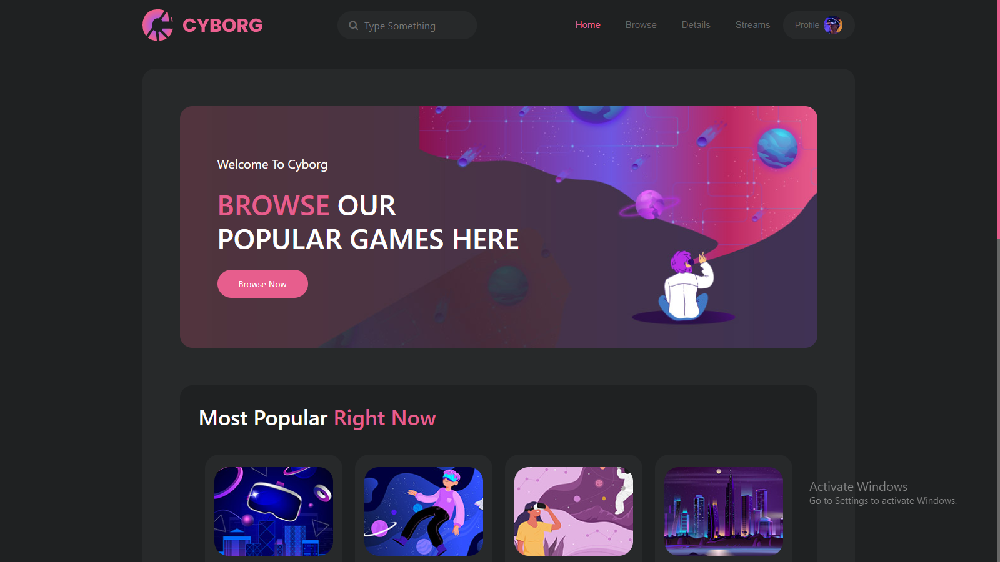

<h1 id="title">Cyborg</h1>

This website is made from a pre-design design which is totally responsive

  

<h2>🧐 Features</h2>

Here're some of the project's best features:

*   Responsive

<h2>💻 Built with</h2>

Technologies used in the project:

*   HTML
*   CSS
*   JavaScript
